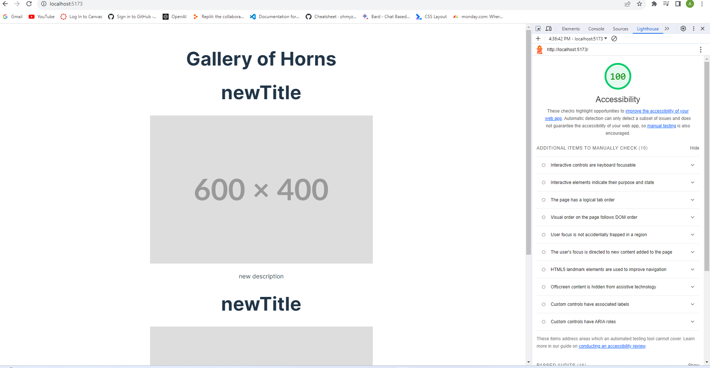
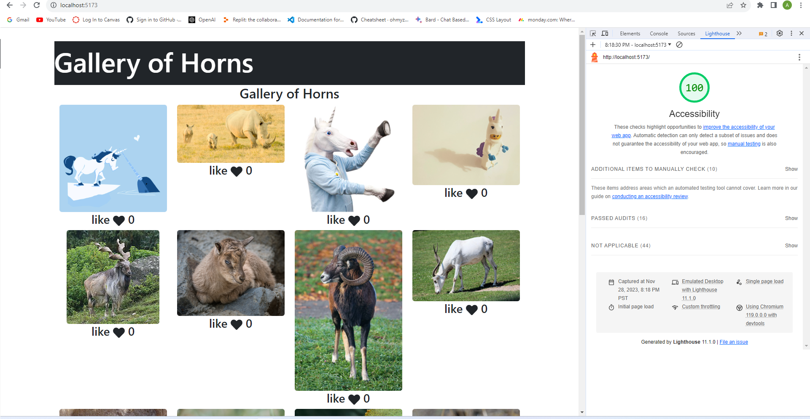

# React + Vite

This template provides a minimal setup to get React working in Vite with HMR and some ESLint rules.

Currently, two official plugins are available:

- [@vitejs/plugin-react](https://github.com/vitejs/vite-plugin-react/blob/main/packages/plugin-react/README.md) uses [Babel](https://babeljs.io/) for Fast Refresh
- [@vitejs/plugin-react-swc](https://github.com/vitejs/vite-plugin-react-swc) uses [SWC](https://swc.rs/) for Fast Refresh

### Lighthouse Report Lab 1

### Lighthouse Report Lab 2

### Time Estimate Lab 2

Number and name of feature: Feature #1 took about 1.5 hours. Feature #2 took about 1.5 hours. Feature #3 took about 2 hours.

Estimate of time needed to complete: 4 hours

Start time: 3 pm

Finish time: 8 pm

Actual time needed to complete: 5 hours
